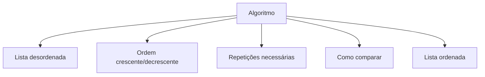

# Learn Sorting Algorithm

## Entendendo Algoritmos de Ordenação

Algoritmos de ordenação funcionam como organizar uma bagunça - você pega uma lista desordenada (como anões de tamanhos diferentes) e os coloca na ordem correta (do menor para o maior ou vice-versa).

Imagine esta fila de anões:


## Conceitos Fundamentais Antes de Começar

Antes de mergulharmos no algoritmo, vamos entender alguns conceitos básicos:

### O que é um Algoritmo?
Um **algoritmo** é simplesmente uma lista de instruções passo a passo para resolver um problema. É como uma receita de bolo - você segue os passos na ordem certa para chegar ao resultado desejado.

> **Exemplo prático**: Para fazer um sanduíche, o algoritmo seria:
> 1. Pegue duas fatias de pão
> 2. Passe manteiga em uma fatia
> 3. Coloque o recheio
> 4. Feche com a outra fatia
> {style="note"}

### O que é Iteração?
**Iteração** é quando repetimos um conjunto de passos várias vezes. É como quando você escova os dentes - faz o mesmo movimento várias vezes até limpar todos os dentes.

Em programação, quando dizemos:
- **"Iteração 1"** = primeira vez que executamos os passos
- **"Iteração 2"** = segunda vez que executamos os passos
- E assim por diante...

### O que é Comparação?
**Comparar** é verificar qual elemento é maior, menor ou igual ao outro. É como quando você compara a altura de duas pessoas para saber quem é mais alto.

## O Básico do Algoritmo de Ordenação

Nosso algoritmo simples compara os elementos um a um, como quando você organiza suas roupas - pega cada peça e compara com as outras para ver qual é maior ou menor.

## Como Funciona na Prática

Agora vamos ver como o algoritmo trabalha **iteração por iteração** (ou seja, repetição por repetição):

### Primeira Iteração (1ª Repetição)
Comparo o primeiro anão ($i_1$) com o segundo anão ($j_1$). 
- **Pergunta**: O primeiro é menor que o segundo?
- **Resposta**: Sim (verdadeiro) → Não preciso trocar nada!


### Segunda Iteração (2ª Repetição)
Agora comparo $i_2$ com $j_2$.
- **Pergunta**: O primeiro é menor que o segundo?
- **Resposta**: Não (falso) → Preciso trocar eles de lugar!


### Terceira Iteração (3ª Repetição)
Comparo $i_{3}$ com $j_{3}$.
- **Pergunta**: O primeiro é menor que o segundo?
- **Resposta**: Sim (verdadeiro) → Não preciso trocar nada!


### Quarta Iteração (4ª Repetição)
Comparo $i_{4}$ com $j_{4}$.
- **Pergunta**: O primeiro é menor que o segundo?
- **Resposta**: Não (falso) → Preciso trocar eles de lugar!


### Quinta Iteração (5ª e Última Repetição)
Agora todos os elementos já estão na ordem correta!


> **Resumo**: A cada iteração, fazemos uma **pergunta** (comparação) e tomamos uma **decisão** (trocar ou não trocar). Repetimos isso até que tudo esteja organizado!
> {style="tip"}

## O Que Todo Algoritmo de Ordenação Precisa

Resumindo, todo algoritmo de ordenação possui:

1. **Entrada**: A lista desordenada
2. **Tipo de ordem**: Crescente ou decrescente
3. **Iterações**: Quantidade de repetições do processo
4. **Comparações**: Critério para comparar os elementos
5. **Saída**: A lista organizada



## Partindo para o Código

Agora vamos ver como transformar nossa lógica em código C++. Vou explicar cada parte:

### Conceitos Básicos Antes do Código

#### O que é um Array?
Um **array** é como uma fileira de caixas numeradas onde guardamos valores. Cada caixa tem um número (índice) e pode guardar um valor.

```
Array: [5] [2] [8] [1] [9]
Índice: 0   1   2   3   4
```

#### O que é um Loop For?
Um **loop for** é uma forma de repetir uma ação várias vezes. É como dizer: "faça isso 10 vezes" ou "faça isso para cada elemento da lista".

```c++
for (int i = 0; i < 5; i++) {
    // Este código vai executar 5 vezes
    // i vai valer: 0, 1, 2, 3, 4
}
```

### O Código Completo Explicado

```c++
#include <iostream>  // Para usar cout e cin (entrada e saída)
#include <cstdlib>   // Para usar rand() (números aleatórios)
#define MAX_SIZE 100 // Define o tamanho máximo do array
using namespace std;

int main()
{
    // PARTE 1: DECLARAÇÃO DAS VARIÁVEIS
    int n;                // Quantos números vamos ordenar
    int array[MAX_SIZE];  // Nossa lista de números (o array)

    // PARTE 2: ENTRADA DE DADOS
    cout << "Digite quantos números você quer ordenar: " << endl;
    cin >> n;  // Lê a resposta do usuário

    // PARTE 3: PREENCHIMENTO COM NÚMEROS ALEATÓRIOS
    cout << "Gerando " << n << " números aleatórios..." << endl;
    for (int i = 0; i < n; i++) {
        array[i] = rand() % 100;  // Gera número entre 0 e 99
    }

    // PARTE 4: MOSTRA A LISTA BAGUNÇADA
    cout << "\nLista original (bagunçada): ";
    for (int i = 0; i < n; i++) {
        cout << "[" << array[i] << "] ";
    }
    cout << endl << endl;

    // PARTE 5: O ALGORITMO DE ORDENAÇÃO (O CORAÇÃO DO PROGRAMA!)
    cout << "Iniciando ordenação..." << endl;
    
    // Loop externo: seleciona cada elemento (iteração principal)
    for (int i = 0; i < n; i++) {
        
        // Loop interno: compara com os elementos seguintes
        for (int j = i + 1; j < n; j++) {
            
            // Mostra o que está sendo comparado
            cout << "Comparando: " << array[i] << " com " << array[j];
            
            // AQUI É ONDE A MÁGICA ACONTECE!
            // Se o primeiro for MENOR que o segundo, trocamos
            if (array[i] < array[j]) {
                cout << " → Trocando!" << endl;
                
                // PROCESSO DE TROCA (como trocar duas cartas de lugar)
                int temp = array[i];  // Guarda o primeiro valor
                array[i] = array[j];  // Põe o segundo no lugar do primeiro
                array[j] = temp;      // Põe o primeiro no lugar do segundo
            } else {
                cout << " → Não precisa trocar" << endl;
            }
        }
    }

    // PARTE 6: MOSTRA O RESULTADO FINAL
    cout << "\n" << "=" << endl;
    cout << "Lista ordenada (maior para menor): ";
    for (int i = 0; i < n; i++) {
        cout << "[" << array[i] << "] ";
    }
    cout << endl;

    return 0;  // Programa terminou com sucesso
}
```

### Pontos Importantes Para Entender:

#### 1. **Como Funciona o rand()**
- `rand()` gera números aleatórios gigantes
- `rand() % 100` limita os números entre 0 e 99 (mais fácil de trabalhar)

#### 2. **Por que Dois Loops For?**
- **Loop externo (i)**: Escolhe cada elemento da lista, um por vez
- **Loop interno (j)**: Compara esse elemento com todos os outros que vêm depois
- É como comparar cada anão com todos os outros anões

#### 3. **Como Funciona a Troca (Swap)?**
Imagine que você tem duas cartas e quer trocar elas de lugar:
```c++
int temp = array[i];  // Guardo a primeira carta na mão
array[i] = array[j];  // Ponho a segunda carta no lugar da primeira
array[j] = temp;      // Ponho a primeira carta (que estava na mão) no lugar da segunda
```

#### 4. **Mudando a Ordem**
- **Para ordem DECRESCENTE** (maior → menor): use `if (array[i] < array[j])`
- **Para ordem CRESCENTE** (menor → maior): use `if (array[i] > array[j])`

### Importante Saber

Este algoritmo se chama **Selection Sort** (Ordenação por Seleção). Ele não é o mais rápido para listas muito grandes, mas é **perfeito para aprender** porque:

* ✅ É fácil de entender  
* ✅ Mostra claramente como funciona a ordenação  
* ✅ Usa conceitos básicos que você vai usar sempre  

> **Dica**: Execute o código algumas vezes com números pequenos (como 5 elementos) para ver exatamente como ele funciona!
> {style="tip"}
