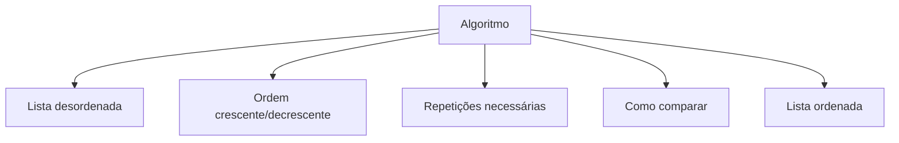

# Learn Sorting Algorithm

## Entendendo Algoritmos de Ordenação

Algoritmos de ordenação funcionam como organizar uma bagunça - você pega uma lista desordenada (como anões de tamanhos diferentes) e os coloca na ordem correta (do menor para o maior ou vice-versa).

Imagine esta fila de anões:


## O Básico Fundamental

Implementei um algoritmo simples que compara os elementos um a um. É como quando você organiza suas roupas - pega cada peça e compara com as outras para ver qual é maior ou menor.

> **Lembrando**: Um algoritmo é apenas uma sequência lógica de passos para resolver um problema.
> {style="note"}

## Como Funciona na Prática

> **Iteração** ocorre quando repetimos o algoritmo várias vezes. Quando dizemos "iteração 1", significa que executamos o algoritmo uma vez.

- **Primeira iteração**: Comparo o primeiro anão ($i_1$) com o segundo ($j_1$). Se $i_1$ for menor, está correto (verdadeiro).  


- **Segunda iteração**: Agora comparo $i_2$ com $j_2$. Se não for menor (falso), preciso trocá-los de lugar.  


(E assim por diante... até que na quinta iteração todos estejam na ordem correta)

## O Que Todo Algoritmo de Ordenação Precisa

Resumindo, todo algoritmo de ordenação possui:

1. **Entrada**: A lista desordenada
2. **Tipo de ordem**: Crescente ou decrescente
3. **Iterações**: Quantidade de repetições do processo
4. **Comparações**: Critério para comparar os elementos
5. **Saída**: A lista organizada



## Partindo para o código

```c
#include <iostream>
#include <cstdlib>
#define MAX_SIZE 100
using namespace std;

int main()
{
    int n;  // Quantidade de elementos
    int array[MAX_SIZE];  // Nosso array (lista)

    // Pede ao usuário informar quantos elementos deseja
    cout << "Enter a number: " << endl;
    cin >> n;

    // Preenche o array com números aleatórios
    for (int i = 0; i < n; i++) {
        array[i] = rand();  // rand() gera número aleatório
    }

    // Exibe o array desordenado
    for (int i = 0; i < n; i++) {
        cout << " [ " << array[i] <<  " ]  ";
    }
    cout << endl;

    // ALGORITMO DE ORDENAÇÃO (o núcleo do código)
    for (int i = 0; i < n; i++) {
        for (int j = i + 1; j < n; j++) {
            // Mostra quais elementos estão sendo comparados
            cout << array[i] << " < " << array[j] << " " << endl;

            // Se o elemento atual for MENOR que o próximo
            if (array[i] < array[j])
            {
                // Realiza a troca (swap) dos elementos
                int temp = array[i];  // Armazena o valor temporariamente
                array[i] = array[j];  // Substitui i por j
                array[j] = temp;     // Completa a troca
            }
        }
    }

    cout << "==============================" << endl;

    // Exibe o array ordenado (em ordem decrescente)
    for (int i = 0; i < n; i++) {
        cout << array[i] << "  ";
    }
    cout << endl;

    return 0;
}
```

### Pontos Importantes:

1. **rand()**: Gera números aleatórios para preencher o array
2. **Dois loops for**: O externo seleciona cada elemento, o interno compara com os demais
3. **Swap (troca)**: Utilizamos uma variável temporária (`temp`) para preservar o valor durante a troca
4. **Ordenação decrescente**: Substitua `<` por `>` para obter ordem crescente

Este é um algoritmo simples (não muito eficiente para listas grandes), mas excelente para compreender o conceito fundamental!
