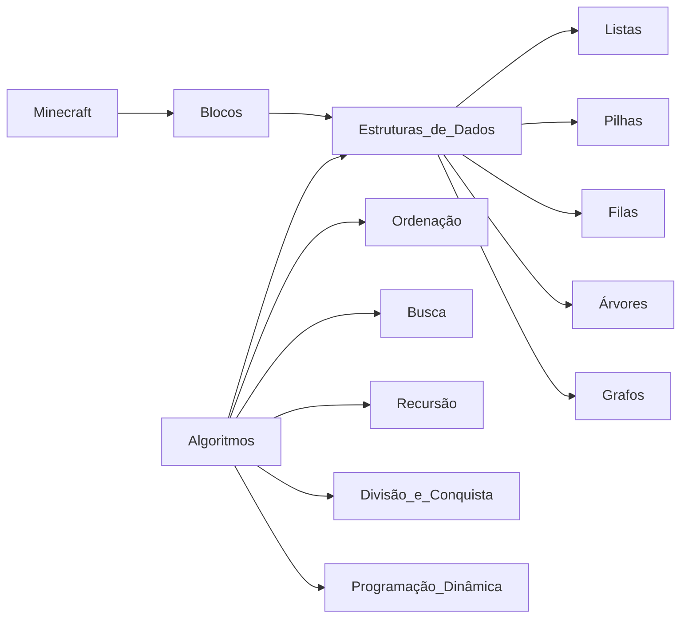

# Learn Data Structures

## Introdução: Minecraft e Estruturas de Dados

Vamos explorar o mundo de Minecraft como um jogo de blocos, onde cada bloco pode representar diferentes elementos de dados. Nesta seção, vamos aprender sobre as estruturas de dados e algoritmos, utilizando a analogia do Minecraft para facilitar a compreensão.

Imagine que você está construindo uma casa com blocos de madeira, pedra, e argila. Cada tipo de bloco tem uma função específica na estrutura da casa. Da mesma forma, as estruturas de dados e algoritmos são como as regras e técnicas que nos ajudam a organizar e manipular dados em nossos computadores, programas, e mundos virtuais.

Aqui está um mapa mental Mermaid que ilustra a relação entre Minecraft, estruturas de dados, e algoritmos:



Neste mapa mental, você pode ver como os blocos de Minecraft estão relacionados às estruturas de dados, como listas, pilhas, filas, árvores, e grafos. Além disso, os algoritmos, como ordenação, busca, recursão, divisão e conquista, programação dinâmica, e estruturas de dados, trabalham juntos para manipular e organizar os dados em nossos jogos e aplicações.

Vamos começar a explorar as estruturas de dados e algoritmos utilizando a analogia do Minecraft!

## Listas

Uma lista é como uma caixa de ferramentas onde você pode armazenar vários blocos de uma só vez. Cada bloco tem uma posição específica na lista, e você pode acessá-los por essa posição.

No Minecraft, você pode construir uma lista de blocos de madeira, pedra, e argila para fazer uma estrutura de muro. Da mesma forma, em programação, você pode usar listas para armazenar dados de diferentes tipos, como números, strings, e objetos.

Aqui está um exemplo de como você pode declarar e usar uma lista em Python:

```python
# Declarando uma lista vazia
blocos = []

# Adicionando blocos à lista
blocos.append("madeira")
blocos.append("pedra")
blocos.append("argila")

# Acessando um bloco específico na lista
primeiro_bloco = blocos[0]

# Imprimindo a lista e o primeiro bloco
print(blocos)
print(primeiro_bloco)
```

## Continuando

Com isso DS (Structure) é um caminho para armazenar  e organizar os dados seguindo um modelo lógico e sistematico para a construção de estruturas de dados.

Pense assim, quando andamos na rua e olhamos um ser com uma esquizoide jeito de se vestir e existir e não sabemos definir qual o sexo, ou seja, se é masculino ou feminino temos então o que chamamos de **dados abstratos**  ou de se compararmos com o audio/video que é emitido pelo tal ser temos uma visualização abstrata.

Esses dados abstratos chamamos na computação de **tipos de dados abstratos** (abstract data types) que estão no mesmo cesto de modelos lógicos/matematicos quando falamos de Estrutura de Dados.

## Abstract Data Type vs. Concrete Implementation

Abstract Data Type (vulgo: ADT para os intimos e famigerados cheiradores de pó-pólenta) é a abstração de um modelo de tipo de dado, que vai definir os pontos chaves para construir determinada estrutura de dados baseado naquele modelo

### Abstraindo a abstracão

Transformando em palavras mais gostosas de ouvir, todo ser humano precisa de uma, logo você me pergunta: 

    Mas o que raios isso tem a ver com o assunto Punk, se tá biruleibe das ideias? 

Calma meu bom acefalo, com celebro lisinho, toda casa (pelo menos como conhecemos sendo uma boa casa) para ser uma casa ela precisa de algumas coisas: 
- Fundação
- Paredes
- Colunas
- Porta
- Janela

Isso é uma abstração de uma casa correto? Isso é de suma o essencial que uma casa precisa ter, esse é o modelo lógico que o que estou querendo construir deve ter, mas isso **NÃO É PROPRIAMENTE** uma casa, isso é uma abstração de uma casa

    Logo o que temos é um ADT então Punk?

[Respondo com um meme do Kirby]


Agora pense que você é um empresário e vai abrir um novo negócio que é uma casa noturna (podemos chamar de bordel caso queira) em, _Xique-Xique Bahia 📍_, e o que ele vai construir é uma casa, certo? 


Sim, então ele vai seguir um ADT um modelo abstrado de tipo de dado que define a abstração, que no nosso caso esse ADT seria uma casa. 

Logo ao fazer a construção do bordel você vai precisar seguir a abstração do modelo que exige:
- Fundação
- Paredes
- Colunas
- Porta
- Janela

Claro que nesse modelo de negócio que você vai construir vai exigir mais coisas.

    Então o bordel que foi feito é a implementação concreta (concrete implementation) de um ADT?

Sim, está correto meu carro frequentador de la casa delas primas

> Claro que não precisamos nos fecharmos apenas ao que modelo nos entrega, mas para a forma concreta ser de determinado ADT ela precisa implementar as questões do modelo

### Falando com programação

Quando vamos para programação o nosso ADT poderia ser uma **Lista** onde ela tem:
- Armazena elementos de diferentes tipos de dados
- Ler um elemento por uma posição
- Modifica um elemento numa determinada posição

Agora nossa implementação concreta seria um **Array** que implementa a abstração de nosso modelo ADT que é a **Lista** 

Com isso vamos entender as Data Structures.
