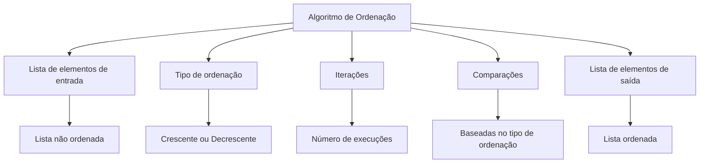

# Learn Sorting Algorithms

Algoritmos de ordenação é quando temos um input (_entrada_) de uma lista por exemplo de anões e você quer ter a saida que é a ordem correta dessa fila por tamanho

Tome-mos que está é a suposta fila: 

Agora vamos implementar um algoritmo simples de ordenação que vai ser compara um por um  os elementos

> Lembrando que algoritmo é uma sequencia finita e lóǵicas de passos a fim de resolver um problema
> {style="note"}

## Aplicando o algorithm

> Lembrando que iteração é o fato de executar um algoritmo uma quantidade finita de vezes
> Então falamos estamos na iteração 1 significa que executamos o algoritmo uma vez

- Na primeira iteração do algorítimo temos que $i_{1}$ é menor que $j_i$, que é uma **verdade** logo ele está no lugar certo:

> Por convenção chamamos quaisquer elementos de uma lista de $i$ e $j$

- Na segunda iteração temos que $i_{2}$ não é menor que $j_{2}$, que é uma **falsidade** (que nem os amores poeris que tive durante a vida) logo ele precisa ser trocado com $i_{2}$:

- Na terceira iteração temos que $i_{3}$ é menor que $j_{3}$, que é uma **verdade** logo ele não precisa ser trocado com $i_{3}$:

- Na quarta iteração temos que $i_{4}$ não é menor que $j_{4}$, que é uma **falsidade** logo ele precisa ser trocado com $i_{4}$:

- Na quita iteração e última já que os elementos estão ordenados corretamente:

## Características dos algoritmos de ordenação

Abstraindo um algoritmo de ordenação, temos que ele possui:

- **Lista de elementos de entrada:** A lista que vamos ordenar.
- **Tipo de ordenação:** Define se a ordenação será crescente ou decrescente.
- **Iterações:** Quantidade de vezes que o algoritmo será executado.
- **Comparações:** O tipo de comparação a ser feita com base no tipo de ordenação.
- **Lista de elementos de saída:** A lista ordenada que esperamos obter ao usar o algoritmo.

